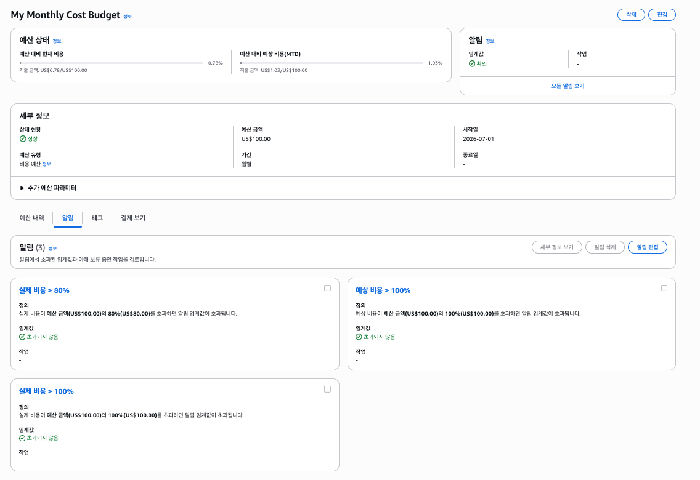
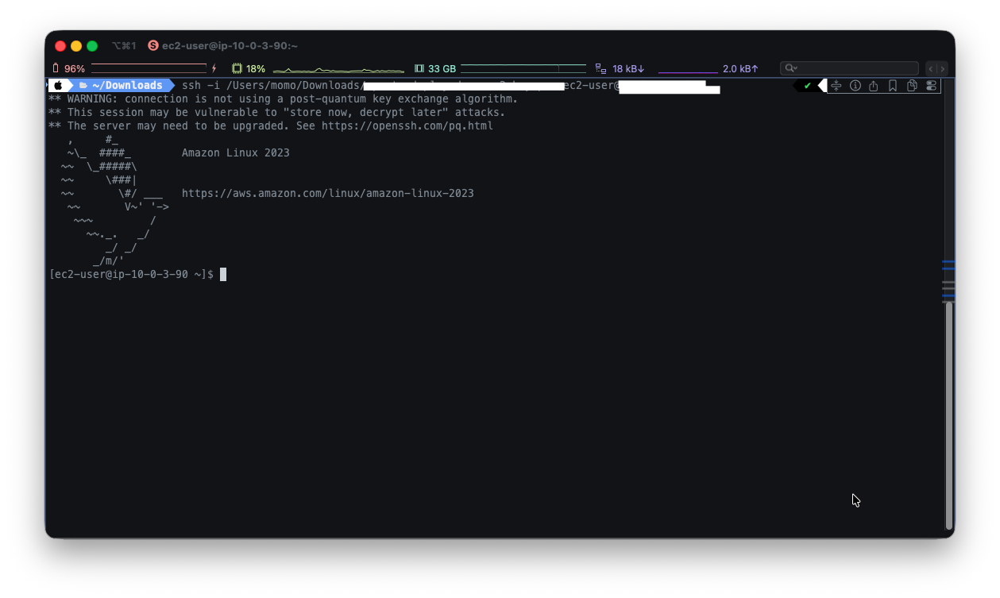

<style>
.blog-image {
  margin: 0 auto;
  border: 1px solid #e8e8e8;
  border-radius: 12px;
  box-shadow: 0 4px 14px rgba(0, 0, 0, 0.06);
}
</style>

# Cloud Architecture Deploy Demo

AWS 상에서 안전하게 중단 없이 운영하기 위한 데모 목적의 프로젝트

## Tech Stack


## Concept

- 팀원들의 정보를 저장하고 불러오는 API
- 프로필 사진을 업로드 하는 API

## Work Flow

### 1. AWS Budget 설정

실수로 비용이 과다하게 발생하는 것을 방지하기 위해 AWS Budget 설정을 하였습니다.



### 2. 네트워크 구축 및 핵심 기능 배포

#### 2-1. 인프라 구축

- VPC 생성


- Public 서브넷에 EC2 생성



### 3. API 프로젝트 개발

#### 3-1. API 구조

- Endpoint

| Method | URI | 설명 |
|--------|-----|------|
| `GET` | `/api/members/{id}` | ID로 멤버 단건 조회 |
| `POST` | `/api/members` | 멤버 생성 |

공통 응답 형식은 `ApiResponse<T>` 를 사용하며, `status`, `message`, `data` 필드를 포함합니다.

```json
{
  "status": 200,
  "message": "정상 조회되었습니다.",
  "data": { ... }
}
```

- Actuator 설정

`spring-boot-starter-actuator` 의존성을 추가하여 애플리케이션 상태를 외부에서 확인할 수 있도록 헬스체크 엔드포인트를 제공합니다.

| Endpoint | 설명 |
|----------|------|
| `GET /actuator/health` | 애플리케이션 상태 확인 |

- 로깅 Filter

`ApiLoggingFilter` (`OncePerRequestFilter` 구현)를 통해 모든 HTTP 요청의 메서드와 URI를 로그로 기록합니다.

```
[API - LOG] GET /api/members/1
[API - LOG] POST /api/members
```

- Exception Handler 처리

`GlobalExceptionHandler` (`@RestControllerAdvice`)에서 예외를 일관된 형식으로 처리합니다.

| 예외 | HTTP 상태 | 설명 |
|------|-----------|------|
| `ApiException` | 예외에 지정된 상태 | 비즈니스 로직 예외 |
| `DataIntegrityViolationException` | `409 Conflict` | DB 제약 조건 위반 |
| `MethodArgumentNotValidException` | `400 Bad Request` | 요청 값 유효성 검사 실패 |
| `Exception` | `500 Internal Server Error` | 예상치 못한 서버 오류 |

#### 3-2. 운영 설정

- Profile 분리

환경별로 설정을 분리하여 로컬 개발과 프로덕션 환경을 독립적으로 관리합니다.

| Profile | 활성화 방법 | DB | ddl-auto |
|---------|------------|-----|----------|
| `local` | `--spring.profiles.active=local` | H2 (파일 기반) | `create` |
| `prod` | `--spring.profiles.active=prod` | MySQL (AWS RDS) | `validate` |
